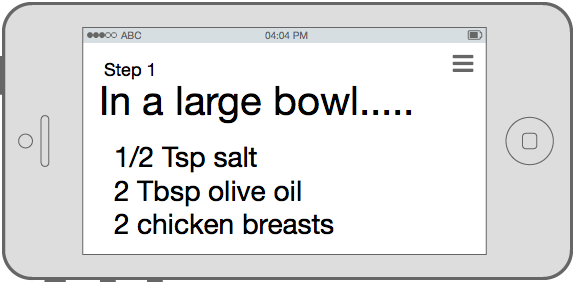

# Sue Chef

####Briefly explain the need for the app (the "what")
Sue Chef is your assistant in the kitchen.
She will help you while you cook by reading the recipe to you and responding to your voice.

Ask Sue "How much oregano should I use?"
	or
"What's the next step?"

####List the stakeholders and customers of the apps (the "who")
Anyone who cooks at home or is a cooking enthusiast would use this app.

####Using wireframes, sketch the most important views of the app.
#####Recipe Detail

##### Guided Cooking

##### Tinder Search

##### Pinterest Search

####Platform Architecture
1. MySQL
2. Node.js server
3. CMU Sphinx for speech recognition
4. Big Oven API 
⋅⋅* (350,000+ recipes)

####Core functionalities
+ Allow user to interact with recipes
+ Sue responds to basic voice commands
	1. "Sue, next step."
	2. "Sue, repeat that step."
	3. 
+ Sue reads the recipes aloud
+ Search for recipes

####List and briefly describe the secondary functionality of the app, the functions and transactions of the app that are nice to have only if time allows.
+ Responds to more advanced commands like "What temperature should I preheat the oven to?"
+ Tinder-style UI for finding new recipes
+ Pinterest-style following other users/chefs
+ Ability to comment and rate recipes 
+ Add recipes from various sites (Pinterest, NYTCooking, Food Network, etc)
+ Take a photo of a recipe and allow Sue to read it
+ Search recipes by nutritional information

####List the features on a mobile device that the app will use (e.g., camera, GPS, SMS, flashlight).
+ Speakers
+ Internet
+ Mic
+ Camera

####Briefly describe any limitations each team member may feel that will hold back progress.
+ Issues with voice recognition
+ Parsing of recipes from non-API sources
+ Difficulty building social aspect of the app

####Briefly describe how your team plans to market or advertise the app.
+ Have YouTube cooks use and mention the app in videos
+ Advertise on cooking and recipe sites
+ Product Hunt
+ Reddit

**Created by Alex Ravan, Chase Crumbaugh, and Vincent Tran**
